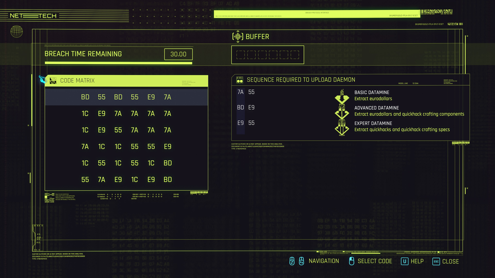

# Cyberpunk 2077 Breach Protocol Solver

A solver (Python library + CLI) for the
["Breach Protocol" hacking minigame](https://cyberpunk.fandom.com/wiki/Quickhacking#Breach_Protocol)
in Cyberpunk 2077.


## Algorithm Overview

The solver runs [depth-first search (DFS)](https://en.wikipedia.org/wiki/Depth-first_search) on the
code matrix. This allows finding solutions (albeit possibly suboptimal ones) in milliseconds in
real-life cases while having a small and almost fixed RAM footprint during the search.

The algorithm maintains a search stack. At each iteration, it keeps track of the following state:
* The cells used so far.
* The number of yet incomplete cells in each upload sequence.
* The rules for selecting the next cell from the code matrix
  (whether to pick from the current row or the current column).

If the current path is hopeless (the remaining buffer length makes it impossible to complete
all sequences), the solver abandons it early.

If the total number of incomplete cells at the current iteration is 0, then a solution is found.
Otherwise, we add the unexplored neighbor cells to the search stack, adjusting or resetting the 
numbers of incomplete cells depending on the cell value we pick next.

The algorithm supports sequence priorities and partial solutions: if it is impossible to complete
all input sequences at the same time, the algorithm discards lower-priority sequences and completes
higher-priority ones as those typically yield more valuable prizes.


## Installation

The project requires Python 3.10+ without any extra dependencies.

The recommended way to work with the project is to install a Python virtual environment
via [Poetry](https://python-poetry.org/):

```shell
poetry install

# Linux / macOS
source .venv/bin/activate

# Windows
.venv\Scripts\activate
```


## Usage

### Specify Input Data

Enter the minigame data in a text file with the following format:

```text
<Cyberdeck buffer size (B)>
<Number of rows in the code matrix (N)>
<Number of upload sequences (M)>
<Row 1 of the code matrix, space-separated> 
<Row 2 of the code matrix, space-separated>
...
<Row N of the code matrix, space-separated>
<Upload sequence 1, space separated>
<Upload sequence 2, space separated>
...
<Upload sequence M, space separated>
```

Example:



`game.txt`
```text
6
6
3
BD 55 BD 55 E9 7A
1C E9 7A 7A 7A 7A
1C E9 55 7A 7A 7A
7A 1C 1C 55 55 E9
1C 55 1C 55 1C BD
55 7A E9 1C E9 BD
7A 55
BD E9
E9 55
```

### Run Solver (CLI)

Find any solution that works for the specified input file:

```shell
python -m cp2077solver.cli game.txt
```

Output:

```text
Solution: 7A BD E9 55 7A 55
Path: (0 5) > (5 5) > (5 4) > (3 4) > (3 0) > (5 0)
BD       55       BD       55       E9       7A (1)
1C       E9       7A       7A       7A       7A
1C       E9       55       7A       7A       7A
7A (5)   1C       1C       55       55 (4)   E9
1C       55       1C       55       1C       BD
55 (6)   7A       E9       1C       E9 (3)   BD (2)

Found 1 solutions in 0.000 seconds
```

Find all solutions that work for the specified input file, ranking them from shortest to longest:

```shell
python -m cp2077solver.cli game.txt --all-solutions
```

### Code-First Usage

```python
from cp2077solver.solver import CodeMatrix
from cp2077solver.solver import GameSpecification
from cp2077solver.solver import SolutionStrategy
from cp2077solver.solver import UploadSequence
from cp2077solver.solver import solve


# Enter the minigame data.
spec = GameSpecification(
    code_matrix=CodeMatrix(
        cells=[
            ["BD", "55", "BD", "55", "E9", "7A"],
            ["1C", "E9", "7A", "7A", "7A", "7A"],
            ["1C", "E9", "55", "7A", "7A", "7A"],
            ["7A", "1C", "1C", "55", "55", "E9"],
            ["1C", "55", "1C", "55", "1C", "BD"],
            ["55", "7A", "E9", "1C", "E9", "BD"],
        ]
    ),
    upload_sequences=[
        UploadSequence(cells=["7A", "55"], priority=1),
        UploadSequence(cells=["BD", "E9"], priority=2),
        UploadSequence(cells=["E9", "55"], priority=3),
    ],
    buffer_size=6,
)

# Find any solution that works.
solutions = solve(spec)

# Find all solutions.
solutions = solve(spec, strategy=SolutionStrategy.FIND_ALL_SOLUTIONS)
```

## Development

Install the development dependencies:

```shell
poetry install --with dev
```

Enter the project shell:
```shell
# Linux / macOS
source .venv/bin/activate

# Windows
.venv\Scripts\activate
```

Run linters:
```shell
# Check for issues only.
make lint

# Check and fix the fixable issues.
make lint-fix
```

Run tests:

```shell
make test
```
